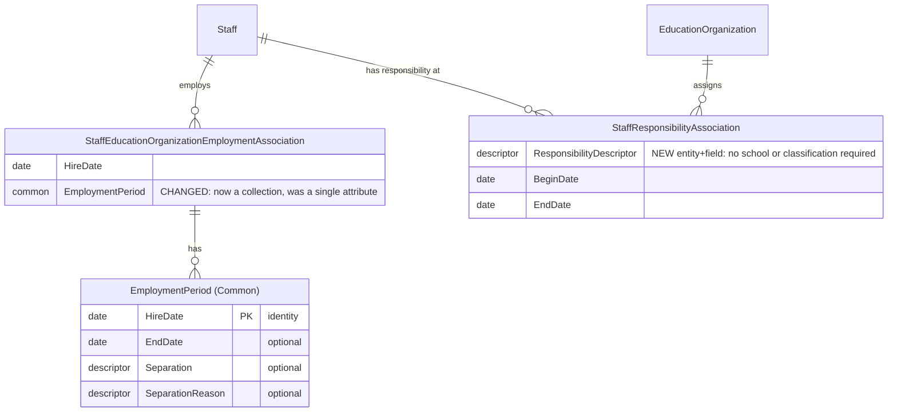

# Mermaid ER Diagram Reference for Design Docs

Mermaid's `erDiagram` does not reliably support per-node or per-attribute
color styling across renderers (GitHub markdown, VS Code preview,
Confluence). Do not rely on styling to show what's new or changed — use
text markers instead, which render everywhere:

- For a **changed** attribute on an existing entity, add an inline comment
  naming the change.
- For a **new** entity, mark it in a legend line below the diagram (new
  entities are visually obvious anyway — they have no incoming edges from
  history — but the legend line makes it explicit for skimmers).
- For a **deprecated** attribute, keep it in the diagram but mark it, so
  reviewers see it's being phased out rather than silently vanishing.

## Naming conventions

- **Entity identifiers are CamelCase, no underscores** —
  `StaffResponsibilityAssociation`, not `STAFF_RESPONSIBILITY_ASSOCIATION`.
  Matches the MetaEd entity name as written, not a SQL-table-style constant.
- **Entities modeled as a `common` get a `(Common)` alias** on their entity
  block, using Mermaid's `EntityName["Alias"]` syntax:
  `EmploymentPeriod["EmploymentPeriod (Common)"] { ... }`. This distinguishes
  reusable common shapes from domain entities/associations at a glance,
  without a separate legend line for every one. Apply the alias at the
  entity's own block definition only — relationship lines use the bare
  identifier. Domain entities, associations, descriptors, and enumerations
  get no alias; only `common`-kind entities do.

## Worked example (Staff domain, partial)

**Legend:**

- `StaffResponsibilityAssociation` — **NEW** (this design's
  proposed "staff responsibility" association)
- `StaffEducationOrganizationEmploymentAssociation.EmploymentPeriod` —
  **CHANGED** (single attribute -> collection)
- `EmploymentPeriod` is a `common`, shown with the `(Common)` alias per the
  naming convention above.
- All other entities/relationships shown are unchanged, included only for
  context.
