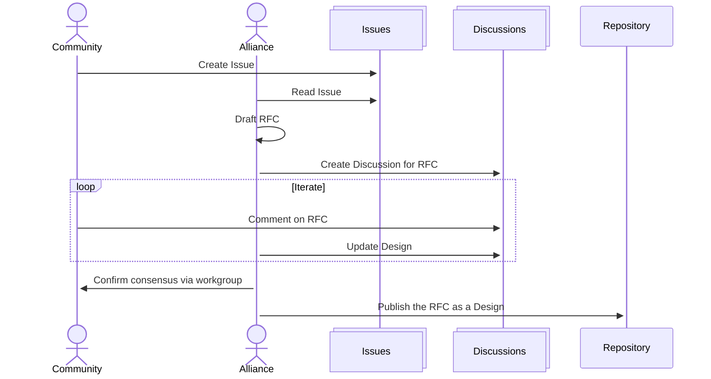

# Ed-Fi API Specifications

[](https://securityscorecards.dev/viewer/?uri=github.com/Ed-Fi-Alliance-OSS/Ed-Fi-API-Specifications)

The [Ed-Fi Alliance](https://www.ed-fi.org) coordinates and publishes
community-led standards and specifications for education and the exchange of education data.

The **Ed-Fi Data Standard** is the widely adopted, CEDS-aligned, open-source
data standard developed by the educational community for the betterment of the
community. The Ed-Fi Data Standard serves as the foundation for enabling
interoperability among secure data systems and contains a Unifying Data Model
designed to capture the meaning and inherent structure in the most important
information in the K–12 education enterprise. _[more
information](https://docs.ed-fi.org/reference/data-exchange)._

An **Ed-Fi compatible API application** creates a REST-based interface for data
exchange, where the messages conform to the Ed-Fi Data Standard. The **Ed-Fi
ODS/API** is the Ed-Fi Alliance's production-ready reference implementation of
an Ed-Fi API. Any interested party can build an alternate, compatible,
application, by adhering to the Open API specifications and guidance provided in
this space.

```none
+------------------+      +---------------------+      +-------------------+
|  Data Standard   | ---> |  API Specifications | ---> |   Application     |
+------------------+      +---------------------+      +-------------------+
| - Unifying Data  |      | - Resources API     |      | - Ed-Fi ODS/API   |
|   Model          |      | - Descriptors API   |      | - Ed-Fi DMS       |
| - Extensions     |      | - Management API    |      | - Ed-Fi Admin API |
+------------------+      +---------------------+      +-------------------+
```

## An Evolving Standard

The Ed-Fi Data Standard evolves through a community-led process:

1. New features or suggested improvements ("Issues") emerge from:

   - Ed-Fi Community member input via events, workgroups, support forums, and direct communication
   - Ed-Fi Alliance staff identifying opportunities for streamlining the system or expanding into a new domain of interest

2. These ideas are logged as GitHub Issues in the [Product Roadmap](https://github.com/orgs/Ed-Fi-Alliance-OSS/projects/2/views/3).

   > [!TIP]
   > Not all Issues identified by the community can be acted on by the Ed-Fi Alliance. We attempt to take a market-driven approach, prioritizing updates that will benefit multiple implementations and/or reduce integration friction for multiple vendors.

3. Ed-Fi Alliance staff and/or community members develop a [Draft Request for Comments (RFC)](https://github.com/Ed-Fi-Alliance-OSS/Ed-Fi-Technology-Roadmap/discussions?discussions_q=label%3ARFC) document and invite comment from the Ed-Fi Community via

   - Direct comment on the draft RFC
   - Discussion at [Data Standard Workgroup](https://edfi.atlassian.net/wiki/spaces/GOV/pages/263127121/Data+Standard+Work+Group) meetings

4. Once the Community and the Alliance have settled on a design for an upcoming release, that Draft RFC is published in this repository's [RFC](./RFC/README.md) directory.



> [!NOTE]
> The Ed-Fi Alliance uses GitHub Issues as the public Product Backlog, and uses Jira for the internal Engineering Backlog. Due to the cost of provisioning access to Jira Cloud, we are unable to invite the community into Jira for comment or review.

## Building an Ed-Fi API Application

What makes an application an "Ed-Fi (compatible) API"? An Ed-Fi API must:

- Implement the following [Open API specifications](api-specifications):
  - Resources API (current version: [5.0](api-specifications/resources/5.0))
  - Descriptors API (current version:
    [5.0](api-specifications/descriptors/5.0))
  - Discovery API (current version: [1.0](api-specifications/discovery/1.0),
    draft revision: [2.0](api-specifications/discovery/2.0-draft))
- And, adhere all of the normative guidance in the [Ed-Fi API
  Guidelines](./api-guidelines/) (current version: [4.0](api-guidelines/v4.0/).

Also see: [Tips for Success in Building an Ed-Fi Compatible
API](./api-guidelines/TIPS-FOR-SUCCESS.md)

## Legal Information

Copyright (c) 2026 Ed-Fi Alliance, LLC and contributors.

Licensed under the [Apache License, Version 2.0](LICENSE) (the "License").

Unless required by applicable law or agreed to in writing, software distributed
under the License is distributed on an "AS IS" BASIS, WITHOUT WARRANTIES OR
CONDITIONS OF ANY KIND, either express or implied. See the License for the
specific language governing permissions and limitations under the License.

See [NOTICES](NOTICES.md) for additional copyright and license notifications.
