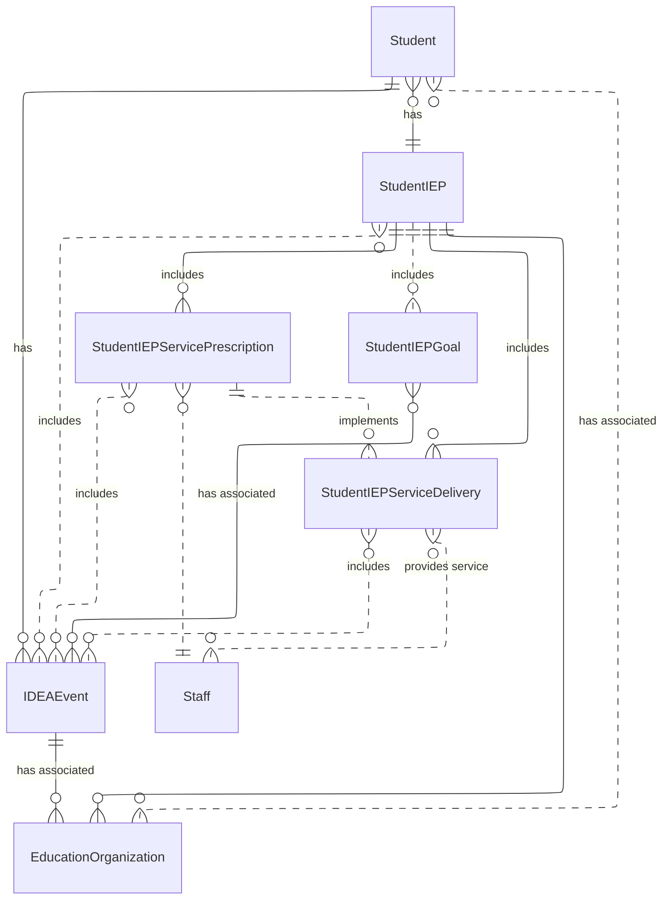

# Ed-Fi RFC 28b: Special Education Data Model (SEDM)

Product: Ed-Fi Data Standard \
Affects: Ed-Fi Data Standard v6.1 \
Obsoletes: -- \
Obsoleted By: -- \
Status: Published \
Author: Steven Arnold (Ed-Fi Alliance)

March 25, 2026

## Synopsis

This Request for Comments (RFC) includes materials that describe proposed additions and revisions to the Ed-Fi Data Standard. This draft material is intended to support review and comment as well as support early usage; users of this material are advised that this work is still under development.

RFC 28(b) merges the Special Education Data Model (SEDM) extension—designed by Education Analytics, AEM Corp, and Public Consulting Group—into the Ed-Fi Data Standard. It introduces five new domain entities that model the Individualized Education Program (IEP) and its associated IDEA events, prescribed services, service delivery, and goals as first-class, auditable records.

## Overview

A student receiving special education services is represented in the Ed-Fi Data Standard by the `StudentSpecialEducationProgramAssociation` (SSEPA) resource. This resource, as its name implies, associates a student to a program at an education organization (generally a school or local education agency). This entity contains elements that closely resemble a student's Individual Education Program (IEP).

The SSEPA models special education primarily as participation in a locally defined program, which creates structural misalignment with how special education operates in practice. SSEPA requires a student to be enrolled in a program and uses program identifiers and enrollment dates as the primary anchors for special education data. Program definitions and lifecycles vary across Local Education Agencies (LEAs) and State Education Agencies (SEAs), and program begin and end dates do not reliably align with IEP effective periods. As a result, changes to an IEP often require creating a new program association or overwriting existing dates, even when the student's enrollment has not changed, leading to ambiguity around which IEP was in effect at a given time and limiting portability across jurisdictions. Additionally, the Ed-Fi standard does not currently provide a way to represent Individuals with Disabilities Education Act (IDEA) related events, IEP related goals, or IEP related service delivery.

In contrast, a model such as SEDM treats the **IEP as a first-class, time-bound legal document**, explicitly capturing IDEA events, service prescriptions, and service delivery as records tied to the IEP rather than inferred from program state. SSEPA does not natively preserve IEP history, represent IDEA events as discrete entities, or support granular tracking of service delivery and goal progress over time; instead, it is optimized to reflect a current program state. This limits the ability to reconstruct compliance timelines, demonstrate procedural intent, or evaluate progress relative to the plan in effect when services were delivered. By anchoring data to the IEP itself, SEDM supports longitudinal analysis, evidence-based reporting, and clearer interpretation of special education obligations without reliance on program constructs that were not designed to carry legal or historical meaning.

## Use Cases

### IDEA Reporting and Compliance

Accurate IDEA reporting and compliance depend on the ability to represent special education activities as discrete, time-bound, and legally significant records rather than as side effects of enrollment or program participation. Modeling IDEA events, IEP plans, service prescriptions, and service delivery as explicit, auditable entities enables precise reconstruction of statutory timelines, procedural safeguards, and service obligations required for federal and state reporting. A compliance-oriented model must preserve when decisions were made, why they were required, and what actions resulted, without overwriting historical context as IEPs are reviewed, amended, or replaced. By aligning the data model with the legal and procedural structure of IDEA—rather than with local operational workflows—the model supports consistent generation of indicators, reduces ambiguity during audits and monitoring, and enables downstream systems to demonstrate compliance based on evidence rather than inference.

### Progress Monitoring

Effective progress monitoring requires a data model that distinguishes between what was planned, what was delivered, and what outcomes were observed over time. By explicitly modeling IEP goals, service prescriptions, and service delivery as discrete, time-bound records tied to a specific IEP, the model enables progress to be evaluated against the original intent of the plan rather than inferred from enrollment, staffing, or assessment data alone. A progress-monitoring-oriented design must preserve historical context as IEPs are amended, services change, or goals are revised, allowing progress to be assessed relative to the plan in effect at the time services were delivered. Aligning the model to the structure of the IEP supports consistent local monitoring, longitudinal analysis, and downstream reporting while avoiding assumptions about instructional effectiveness or compliance that cannot be supported by evidence captured in the data.

### IEP Portability

IEP portability is essential because the Individualized Education Program is a student-specific legal artifact whose meaning, obligations, and history must remain intact across changes in enrollment, education organizations, and local program structures. Modeling the IEP as a first-class, portable entity—independent of program participation—ensures that IDEA events, prescribed services, and service delivery records can be exchanged and interpreted consistently without reliance on locally defined programs that do not translate across jurisdictions. A portable IEP model preserves the intent and effective dates of the plan, supports accurate reconstruction of compliance timelines, and enables continuity of services when students transition between LEAs or SEAs. By anchoring special education data to the IEP itself rather than to enrollment or program constructs, the model improves interoperability, historical fidelity, and downstream reporting while reducing ambiguity and data loss during student mobility.

## Model

### Entity Relationship Overview

### StudentIEP

The `StudentIEP` entity represents the Individualized Education Program as a first-class, time-bound legal document, independent of program enrollment. It anchors special education data to the plan that was finalized at a specific point in time, preserving IEP effective periods, amendments, and historical continuity across school years and organizational changes.

When an IEP is amended, a new `StudentIEP` record should be created with the amended data rather than modifying the existing record. The `IEPAmendedDate` field records the date of amendment on the new record to maintain a clear audit trail.

**Identity**

| Field                   | Type         | Description                                                                                          |
| ----------------------- | ------------ | ---------------------------------------------------------------------------------------------------- |
| `EducationOrganization` | Reference    | The identifier assigned to the education organization (usually District/LEA) providing IEP Services. |
| `Student`               | Reference    | A reference to the student.                                                                          |
| `StudentIEPIdentifier`  | String (120) | A unique identifier assigned by the provider or source system of IEP services.                       |

**Properties**

| Field                          | Type                  | Required | Description                                                                                                                                                                                                                                                                                                                                                                                                                                                                                                                                                                                                                                                                                                                                                                         |
| ------------------------------ | --------------------- | -------- | ----------------------------------------------------------------------------------------------------------------------------------------------------------------------------------------------------------------------------------------------------------------------------------------------------------------------------------------------------------------------------------------------------------------------------------------------------------------------------------------------------------------------------------------------------------------------------------------------------------------------------------------------------------------------------------------------------------------------------------------------------------------------------------- |
| `IEPBeginDate`                 | Date                  | Required | The projected date for the beginning of special education and related services.                                                                                                                                                                                                                                                                                                                                                                                                                                                                                                                                                                                                                                                                                                     |
| `IEPEndDate`                   | Date                  | Required | The effective end date of the IEP.                                                                                                                                                                                                                                                                                                                                                                                                                                                                                                                                                                                                                                                                                                                                                  |
| `IEPStatus`                    | Descriptor            | Required | The current status of the IEP.                                                                                                                                                                                                                                                                                                                                                                                                                                                                                                                                                                                                                                                                                                                                                      |
| `IEPFinalizedDate`             | Date                  | Optional | The date the IEP was finalized.                                                                                                                                                                                                                                                                                                                                                                                                                                                                                                                                                                                                                                                                                                                                                     |
| `IEPAmendedDate`               | Date                  | Optional | The date when the IEP was last amended, if any. When amended, a new StudentIEP should be created with the amended data recorded.                                                                                                                                                                                                                                                                                                                                                                                                                                                                                                                                                                                                                                                    |
| `MedicallyFragile`             | Boolean               | Optional | Indicates whether the student receiving special education and related services is: 1) in the age range of birth to 22 years, and 2) has a serious, ongoing illness or a chronic condition that has lasted or is anticipated to last at least 12 or more months or has required at least one month of hospitalization, and that requires daily, ongoing medical treatments and monitoring by appropriately trained personnel which may include parents or other family members, and 3) requires the routine use of medical device or of assistive technology to compensate for the loss of usefulness of a body function needed to participate in activities of daily living, and 4) lives with ongoing threat to his or her continued well-being. Aligns with federal requirements. |
| `MultiplyDisabled`             | Boolean               | Optional | Indicates whether the student receiving special education and related services has been designated as multiply disabled by the admission, review, and dismissal committee as aligned with federal requirements.                                                                                                                                                                                                                                                                                                                                                                                                                                                                                                                                                                     |
| `SchoolHoursPerWeek`           | Decimal (5,2)         | Optional | Indicate the total number of hours of instructional time per week for the school that the student attends.                                                                                                                                                                                                                                                                                                                                                                                                                                                                                                                                                                                                                                                                          |
| `SpecialEducationHoursPerWeek` | Decimal (5,2)         | Optional | Indicates the total number of hours of time per week specific to special education related services.                                                                                                                                                                                                                                                                                                                                                                                                                                                                                                                                                                                                                                                                                |
| `SpecialEducationSetting`      | Descriptor            | Optional | The major instructional setting (more than 50 percent of a student's special education program).                                                                                                                                                                                                                                                                                                                                                                                                                                                                                                                                                                                                                                                                                    |
| `ReasonExited`                 | Descriptor            | Optional | The reason why a person stops receiving special education services.                                                                                                                                                                                                                                                                                                                                                                                                                                                                                                                                                                                                                                                                                                                 |
| `Accommodation`                | Descriptor collection | Optional | The special variation(s) to be used in how various services (in general) are presented, how they are administered, or how the student is allowed to respond. This generally refers to changes that do not substantially alter the content that the service renders. The proper use of accommodations does not substantially change academic level or performance criteria.                                                                                                                                                                                                                                                                                                                                                                                                          |
| `Disability`                   | Common collection     | Optional | The disability condition(s) that best describes an individual's impairment, as determined by evaluation(s) conducted by the education organization.                                                                                                                                                                                                                                                                                                                                                                                                                                                                                                                                                                                                                                 |
| `IDEAEvent`                    | Reference collection  | Optional | A reference to the IDEA events associated with the student's IEP.                                                                                                                                                                                                                                                                                                                                                                                                                                                                                                                                                                                                                                                                                                                   |

> **Note on dates:** Date interpretation may vary. Ed-Fi recommends inclusive dates, but states may define dates as inclusive or exclusive. Align with local guidelines for calculations.

### IDEAEvent

The `IDEAEvent` entity captures legally significant events required under IDEA—such as referrals, evaluations, parental consent, meetings, and IEP approval—as discrete, auditable records. Explicitly modeling these events enables systems to reconstruct procedural timelines, understand why actions were taken, and demonstrate compliance based on evidence rather than inference.

**Identity**

| Field                   | Type         | Description                                                                                           |
| ----------------------- | ------------ | ----------------------------------------------------------------------------------------------------- |
| `EducationOrganization` | Reference    | The identifier assigned to the education organization (usually District/LEA) providing IDEA Services. |
| `Student`               | Reference    | A reference to the student.                                                                           |
| `IdeaEventIdentifier`   | String (120) | A unique identifier for the event record as assigned by the provider of IEP services.                 |
| `IDEAEvent`             | Descriptor   | The IDEA event recorded for the student.                                                              |

**Properties**

| Field             | Type          | Required | Description                                           |
| ----------------- | ------------- | -------- | ----------------------------------------------------- |
| `BeginDate`       | Date          | Required | The date when the IDEA related event started.         |
| `EndDate`         | Date          | Optional | The date when the IDEA related event concluded.       |
| `EventCompliance` | Descriptor    | Optional | The type of compliance represented by this event.     |
| `EventReason`     | Descriptor    | Optional | The reason the IDEA event occurred.                   |
| `EventNarrative`  | String (2048) | Optional | Detailed and summary notes recorded during the event. |

### StudentIEPServicePrescription

`StudentIEPServicePrescription` defines the services a student is entitled to receive under a specific IEP, including frequency, duration, and effective dates. Separating prescribed services from delivery clarifies what was planned versus what was implemented and ensures that service obligations are evaluated relative to the IEP in effect at the time. This entity provides a stable reference for compliance checks, progress monitoring, and service continuity when plans are amended.

**Identity**

| Field                              | Type         | Description                                                                                |
| ---------------------------------- | ------------ | ------------------------------------------------------------------------------------------ |
| `StudentIEP`                       | Reference    | The IEP for which the service is prescribed.                                               |
| `IEPServicePrescriptionIdentifier` | String (120) | A unique identifier assigned by the provider of IEP services for the prescription record.  |
| `ServicePrescription`              | Descriptor   | The type of service prescribed. Examples include: Auditory Specialist, Vocational Therapy. |
| `ServicePrescriptionDate`          | Date         | The date the service was prescribed.                                                       |

**Properties**

| Field                 | Type                 | Required | Description                                                                                                                                  |
| --------------------- | -------------------- | -------- | -------------------------------------------------------------------------------------------------------------------------------------------- |
| `BeginDate`           | Date                 | Required | The effective date when service is to begin.                                                                                                 |
| `EndDate`             | Date                 | Optional | The effective date when the prescribed service ended.                                                                                        |
| `Duration`            | Integer              | Required | The length of time for the prescribed service in minutes.                                                                                    |
| `DurationInterval`    | Descriptor           | Required | How often the prescribed service is to be provided within the specified duration period. Examples include: Per Session, Per Week, Per Month. |
| `Frequency`           | Decimal              | Required | The number of times the prescribed service is to be provided within the specified duration period.                                           |
| `FrequencyInterval`   | Descriptor           | Required | How often the frequency should repeat for the prescribed service. Examples include: Per Session, Weekly, Monthly.                            |
| `ServiceLocationType` | Descriptor           | Required | The type of location where the prescribed service is to be provided. Examples include: Home, Hospital, School.                               |
| `Staff`               | Reference collection | Optional | A reference to the staff member(s) assigned to provide the prescribed service.                                                               |
| `IDEAEvent`           | Reference collection | Optional | A reference to one or more IDEA events associated with a student.                                                                            |

### StudentIEPServiceDelivery

The `StudentIEPServiceDelivery` entity records the actual delivery of services prescribed in the IEP, including when services occurred and who provided them. Modeling service delivery explicitly enables districts and states to assess whether services were provided as required, rather than assuming delivery based on enrollment or staffing data. This distinction supports evidence-based compliance reviews, operational monitoring, and retrospective analysis of service implementation.

**Identity**

| Field                          | Type         | Description                                                                           |
| ------------------------------ | ------------ | ------------------------------------------------------------------------------------- |
| `StudentIEP`                   | Reference    | The student and IEP associated with the delivery of prescribed services.              |
| `IEPServiceDeliveryIdentifier` | String (120) | A unique identifier assigned by the provider of IEP services for the delivery record. |
| `ServiceDelivery`              | Descriptor   | The type of services delivered to the student.                                        |
| `ServiceDeliveryDate`          | Date         | The date when prescribed services were delivered for a student.                       |

**Properties**

| Field                           | Type                 | Required | Description                                                                |
| ------------------------------- | -------------------- | -------- | -------------------------------------------------------------------------- |
| `StudentIEPServicePrescription` | Reference            | Optional | Identifies the service prescribed for the student.                         |
| `Provider`                      | Common collection    | Optional | The service provider that delivered the prescribed service to the student. |
| `IDEAEvent`                     | Reference collection | Optional | A reference to one or more student IDEA events.                            |

### StudentIEPGoal

`StudentIEPGoal` represents the goals established as part of an IEP, including their achievement periods and intended outcomes. By tying goals directly to the IEP document, the model preserves the context needed to evaluate progress relative to the plan in effect at the time goals were set. This supports consistent progress monitoring over time, even as IEPs are revised or replaced.

**Identity**

| Field               | Type         | Description                                                   |
| ------------------- | ------------ | ------------------------------------------------------------- |
| `StudentIEP`        | Reference    | The IEP for which the goal is prescribed.                     |
| `IEPGoalIdentifier` | String (120) | A unique identifier assigned by the provider of IEP services. |

**Properties**

| Field                   | Type                 | Required | Description                                                                                                     |
| ----------------------- | -------------------- | -------- | --------------------------------------------------------------------------------------------------------------- |
| `IEPGoalType`           | Descriptor           | Required | A focused goal prescribed as part of the IEP. Examples include Academic Goal, Behavioral Goal, Attendance Goal. |
| `IEPGoalDetails`        | String (2048)        | Required | Instructions or other details specific to the student and/or provider for achieving the stated goal.            |
| `GoalAchievementPeriod` | Common (Period)      | Optional | The time period for which the goal is applicable or effective.                                                  |
| `IDEAEvent`             | Reference collection | Optional | A reference to one or more IDEA events associated with a student.                                               |

## API Specifications

This RFC introduces five new REST API resources under the `ed-fi` namespace, following standard Ed-Fi API conventions. Each resource supports `GET`, `POST`, `PUT`, and `DELETE` operations.

| Resource                      | Route                                   |
| ----------------------------- | --------------------------------------- |
| StudentIEP                    | `/ed-fi/studentIEPs`                    |
| IDEAEvent                     | `/ed-fi/ideaEvents`                     |
| StudentIEPServicePrescription | `/ed-fi/studentIEPServicePrescriptions` |
| StudentIEPServiceDelivery     | `/ed-fi/studentIEPServiceDeliveries`    |
| StudentIEPGoal                | `/ed-fi/studentIEPGoals`                |

A full OpenAPI specification will be published with the final version of this RFC. Reviewers are encouraged to test the draft specification using [Swagger Editor](https://editor.swagger.io/), [Postman](https://www.postman.com/), or [Bruno](https://www.usebruno.com/).
