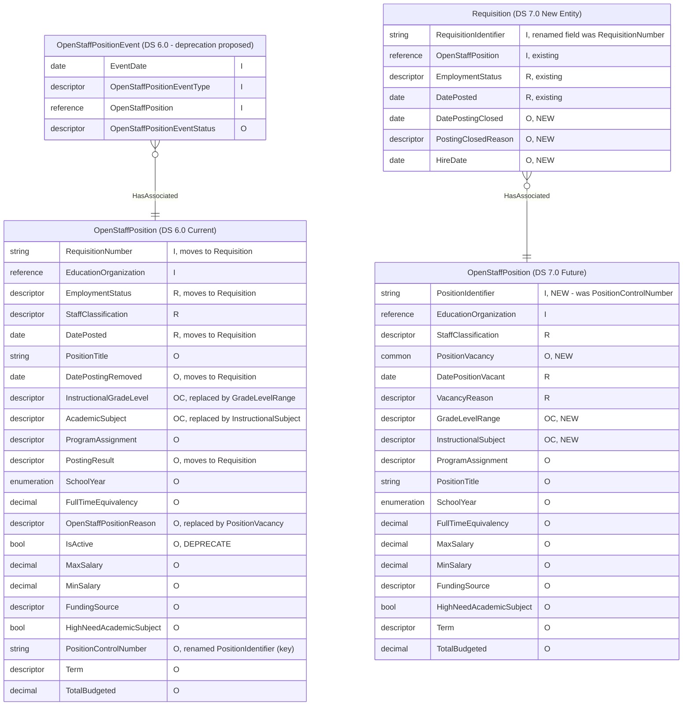

# Ed-Fi RFC 29a: OpenStaffPosition & Requisition Model Changes (Staff Domain)

Product: Ed-Fi Data Standard \
Affects: Ed-Fi Data Standard v7.0 \
Obsoletes: -- \
Obsoleted By: -- \
Status: Draft for community feedback \
Author: --

July 14, 2026

## Synopsis

This Request for Comments (RFC) includes materials that describe proposed revisions to the Ed-Fi Data Standard. This draft material is intended to support review and comment; users of this material are advised that this work is still under development.

RFC 29a proposes separating the current `OpenStaffPosition` entity into two concepts — the open position and the requisition to fill it — by introducing a new `Requisition` entity, promoting a renamed `PositionIdentifier` to the position's identity, adding a `PositionVacancy` common type, and introducing staffing-scoped `GradeLevelRange` and `InstructionalSubject` descriptors. This aligns the core Data Standard with how the concept is implemented in the field today.

This is a **breaking change** for the Staff domain, targeted for Ed-Fi Data Standard v7.0 with interim deprecation flags in v6.1. It is being published for community feedback **before** it is finalized. The design intentionally stays close to the field implementation while remaining flexible enough for other states to adopt.

## Overview

The Staff domain currently (DS 6.0) represents staff vacancies with two entities:

- **`OpenStaffPosition`** — identity is `RequisitionNumber` + `EducationOrganization`, and it carries both *position* attributes (`StaffClassification`, grade levels, subjects, salary ranges, etc.) **and** *requisition/posting* attributes (`DatePosted`, `DatePostingRemoved`, `PostingResult`, `EmploymentStatus`).
- **`OpenStaffPositionEvent`** — added in DS 6.0 to record position milestones.

The current model combines two distinct concepts: the *position* (an approved role open for application) and the *requisition* (a posting for it, with its own dates and outcome — and a posting may close without a hire). Because both share one entity keyed on `RequisitionNumber`, it is hard to track a position independently of the requisition(s) used to fill it, or to key the position by its durable HR-assigned identifier. Separating them, as the field implementation does, resolves this and supports multiple requisitions per position.

Texas (TEA), currently on DS 4.x, extended the model with two entities — `OpenStaffPositionExt` (keyed on `LocalEducationAgency` + `PositionNumber`, with a `PositionVacancy` common) and `RequisitionExt` (posting lifecycle, keyed on `RequisitionNumber`). It is the primary field implementation informing this RFC; other surveyed states reported no active use of `OpenStaffPosition`.

Under the proposed design, the two concepts are defined as follows:

| Entity | Definition |
|---|---|
| **`OpenStaffPosition`** | An approved role that is open for public application — a *position* associated with a vacancy. Carries the position's identity, classification, grade range, instructional subject, and vacancy details. One position can be associated to many requisitions. |
| **`Requisition`** (new) | A posting to fill an open staff position, with open/close dates and hiring outcomes, backed by a corresponding HR approval. A single open position may have **multiple** requisitions over time (e.g., a posting closes, then reopens pending budget). |

Two descriptor-level gaps compound the structural one:

- **Grade level is too granular for staffing.** Positions are posted at a *range* (e.g., Elementary, K-5, 9-12) and hired into specific grades later — a posting for an elementary opening may be filled by a teacher hired into a 3rd-grade role. Individual grade values create churn without serving the staffing use case.
- **`AcademicSubject` is assessment-scoped and too widely used to repurpose.** Its values are the subjects students are *assessed* on, and it is referenced across 26 of 37 subdomains — changing it would be highly impactful. Staffing needs subject-of-*instruction* values (e.g., Self-Contained, Non-Classroom Role, Technology Applications) that are inappropriate for an assessment descriptor.

## Use Cases

### Tracking Positions Independently of Requisitions

An approved position is a durable HR construct with its own identity, while the postings used to fill it come and go. Keying `OpenStaffPosition` on the HR-assigned `PositionIdentifier` and moving the posting lifecycle to `Requisition` allows a position to be tracked across multiple requisitions over time — for example, a posting that closes without a hire and reopens pending budget — without overwriting or duplicating position records.

### Range-Based Grade Levels for Staffing

Positions are posted at a grade *range* (Elementary, K-5, 9-12) and hired into specific grades later. The new `GradeLevelRange` descriptor serves this staffing use case directly, replacing the use of individual `InstructionalGradeLevel` values that create churn without adding value.

### Staffing-Scoped Instructional Subjects

Staffing needs subject-of-instruction values (e.g., Self-Contained, Non-Classroom Role, Technology Applications) that do not belong in the assessment-scoped `AcademicSubject` descriptor. The new `InstructionalSubject` descriptor carries these values on `OpenStaffPosition`, while `AcademicSubject` remains unchanged for its 26+ other subdomains.

## Model

### Entity Relationship Overview

> **Notation:** `I` = identity / key · `R` = required · `O` = optional · `C` = collection (`RC`/`OC`) · flags: `NEW`, `DEPRECATE`, and inline notes for relocations/renames. Diagram is an exact match of `OpenStaffPosition - Current and Future Comparison.mmd`.

`OpenStaffPosition` relates to `Requisition` as **1 → 0..\***: one position may have multiple requisitions/postings over time (closed, reopened pending budget, etc.).

### OpenStaffPosition

The reshaped `OpenStaffPosition` entity represents an approved role that is open for public application. Its identity is the durable HR-assigned `PositionIdentifier` (renamed from `PositionControlNumber`, String, max 20) plus `EducationOrganization`; `RequisitionNumber` and the posting/hiring attributes relocate to the new `Requisition` entity. A new `PositionVacancy` common type (`DatePositionVacant`, `VacancyReason`) replaces `OpenStaffPositionReason` (deprecated), and `IsActive` is removed (redundant — posting dates cover it). `SchoolYear` is retained as optional; a confirmed use case requires it.

The abstract `EducationOrganization` reference is retained at this time (not narrowed to `LocalEducationAgency`). This preserves flexibility; a school-level reference is a possible future need but could affect authorization patterns, so it is out of scope for now (see Questions for the Community).

**Identity**

| Field | Type | Description |
|---|---|---|
| `EducationOrganization` | Reference | The education organization where the position is open. Abstract reference retained (see Questions for the Community). |
| `PositionIdentifier` | String (20) | The durable HR-assigned identifier for the role. Renamed from `PositionControlNumber` and promoted to the identity. |

**Properties**

| Field | Type | Required | Description |
|---|---|---|---|
| `StaffClassification` | Descriptor | Required | The classification of the position (existing field, unchanged). |
| `PositionVacancy` | Common | Optional | Vacancy details for the position: `DatePositionVacant` and `VacancyReason`. New common type; replaces `OpenStaffPositionReason` (deprecated). |
| `GradeLevelRange` | Descriptor collection | Optional | The grade-level range(s) served by the position. New descriptor; replaces `InstructionalGradeLevel` on this entity. |
| `InstructionalSubject` | Descriptor collection | Optional | The subject(s) of instruction for the position. New descriptor; replaces `AcademicSubject` usage on this entity (`AcademicSubject` itself is not renamed or removed). |
| `ProgramAssignment` | Descriptor | Optional | Existing field, unchanged. |
| `PositionTitle` | String | Optional | Existing field, unchanged. |
| `SchoolYear` | Enumeration | Optional | Retained; a confirmed use case requires it. |
| `FullTimeEquivalency` | Decimal | Optional | Existing field, unchanged. |
| `MinSalary` | Decimal | Optional | Existing field, unchanged. Must remain optional (see design principle below). |
| `MaxSalary` | Decimal | Optional | Existing field, unchanged. Must remain optional (see design principle below). |
| `FundingSource` | Descriptor | Optional | Existing field, unchanged. |
| `HighNeedAcademicSubject` | Boolean | Optional | Existing field, unchanged. |
| `Term` | Descriptor | Optional | Existing field, unchanged. |
| `TotalBudgeted` | Decimal | Optional | Existing field, unchanged. |

### Requisition

The new `Requisition` entity holds the posting lifecycle for an open staff position: a posting to fill the position, with open/close dates and hiring outcomes, backed by a corresponding HR approval. It references `OpenStaffPosition`, and a single position may have multiple requisitions over time.

**Identity**

| Field | Type | Description |
|---|---|---|
| `RequisitionIdentifier` | String | The identifier for the requisition. Renamed from `RequisitionNumber` (relocated from `OpenStaffPosition`). |
| `OpenStaffPosition` | Reference | The open staff position the requisition is intended to fill. Whether this reference belongs in the identity is an open question (see Questions for the Community). |

**Properties**

| Field | Type | Required | Description |
|---|---|---|---|
| `EmploymentStatus` | Descriptor | Required | Relocated from `OpenStaffPosition`. |
| `DatePosted` | Date | Required | Relocated from `OpenStaffPosition`. |
| `DatePostingClosed` | Date | Optional | New; succeeds `DatePostingRemoved`. |
| `PostingClosedReason` | Descriptor | Optional | New; replaces `PostingResult` (same description reused). |
| `HireDate` | Date | Optional | New. |

### OpenStaffPositionEvent

Deprecation of `OpenStaffPositionEvent` is **proposed** to the community — its cases are handled by the `Requisition` lifecycle. The model retains it until the community decides (see Questions for the Community).

### New Descriptors

| Descriptor | Notes |
|---|---|
| `GradeLevelRange` | New; range-based grade values for staffing (see open question on naming/approach). |
| `InstructionalSubject` | New descriptor (not a rename of `AcademicSubject`). Values sourced from the field list plus the applicable `AcademicSubject` values. Rationale: `AcademicSubject` is assessment-scoped and used in 26/37 subdomains; a distinct descriptor keeps staffing subjects separate. TEA confirmed (March 2026) `AcademicSubject` should not be reused for this purpose. |
| `VacancyReason` | New; field definition to be used. |
| `PostingClosedReason` | Replaces `PostingResult` (same description reused). |

### Naming Conventions

Per Ed-Fi model standards, a *string* that serves as an identity is named with an **`Identifier`** suffix (a string labeled `…Number` is inaccurate). Accordingly, `PositionControlNumber` → **`PositionIdentifier`** and `RequisitionNumber` → **`RequisitionIdentifier`**. The `Requisition` entity name is kept **agnostic** (rather than "StaffRequisition") to align with field usage and avoid state-specific framing.

### Design Principle: Optional Stays Optional

Field feedback was explicit: if value-add elements (salary, FTE, funding source, term, total budgeted, high-need subject) become **required or key**, implementers will maintain **extensions** rather than adopt the core entity — and in at least one state, collecting salary data is not legislatively authorized, so `MinSalary`/`MaxSalary` **cannot** be mandatory. All such elements remain **optional**. The overriding goal is a model flexible enough for other states to adopt.

## Breaking Changes & Migration

The proposed identity changes are summarized below:

| Entity | DS 6.0 key | Proposed DS 7.0 key |
|---|---|---|
| `OpenStaffPosition` | `RequisitionNumber` + `EducationOrganization` | `PositionIdentifier` + `EducationOrganization` |
| `Requisition` (new) | — | `RequisitionIdentifier` + `OpenStaffPosition` |

- `RequisitionNumber` removed from the `OpenStaffPosition` identity and relocated to `Requisition` as `RequisitionIdentifier`.
- `PositionControlNumber` **renamed** to `PositionIdentifier` and promoted to identity — existing implementations must remap.
- `InstructionalGradeLevel` on this entity replaced by `GradeLevelRange`; `AcademicSubject` usage on this entity replaced by the new `InstructionalSubject` (core `AcademicSubject` unchanged for other domains).
- `OpenStaffPositionReason` deprecated in favor of `PositionVacancy`; `IsActive` removed.
- Posting/hiring attributes relocate to `Requisition`, with renames `DatePostingRemoved → DatePostingClosed`, `PostingResult → PostingClosedReason`; new `HireDate`.
- `OpenStaffPositionEvent` deprecation is **proposed** (pending community input).

**Interim (DS 6.1):** the elements/entity slated for change would be **flagged as deprecated in v6.1** to give the community advance notice. No structural change occurs in 6.1.

## Questions for the Community

This topic was introduced at the DSWG in June 2026. This RFC consolidates that discussion and the field analysis for broader community feedback ahead of finalization.

1. **Education-organization level.** We are proceeding with `EducationOrganization`. Does anyone require a link to a **school** or **schools** associated to the open staff position(s)?
2. **`InstructionalGradeRange` naming/approach.** Ed-Fi already has School Category, which groups grades as elementary/middle/etc. Does this satisfy the current need or can this field be used?
3. **Deprecating `OpenStaffPositionEvent`.** With the posting lifecycle on `Requisition`, is anyone using this entity — particularly for recruitment-event tracking?
4. **Candidate / applicant tracking.** The model has no fields to track applicants or link hired staff/applications (it currently serves the state-reporting persona). Candidate data likely belongs on the `OpenStaffPosition` side — is this needed in core, or left to extensions for now?

## Timeline

- **Target release:** DS 7.0.
- **Community:** introduced at DSWG June 2026; feedback window open now toward finalization.

## How to Respond

Please comment with your implementation context (state/vendor, whether you use `OpenStaffPosition` today) and your answers to the questions above. Your feedback will shape the final RFC submitted to the governance process.
