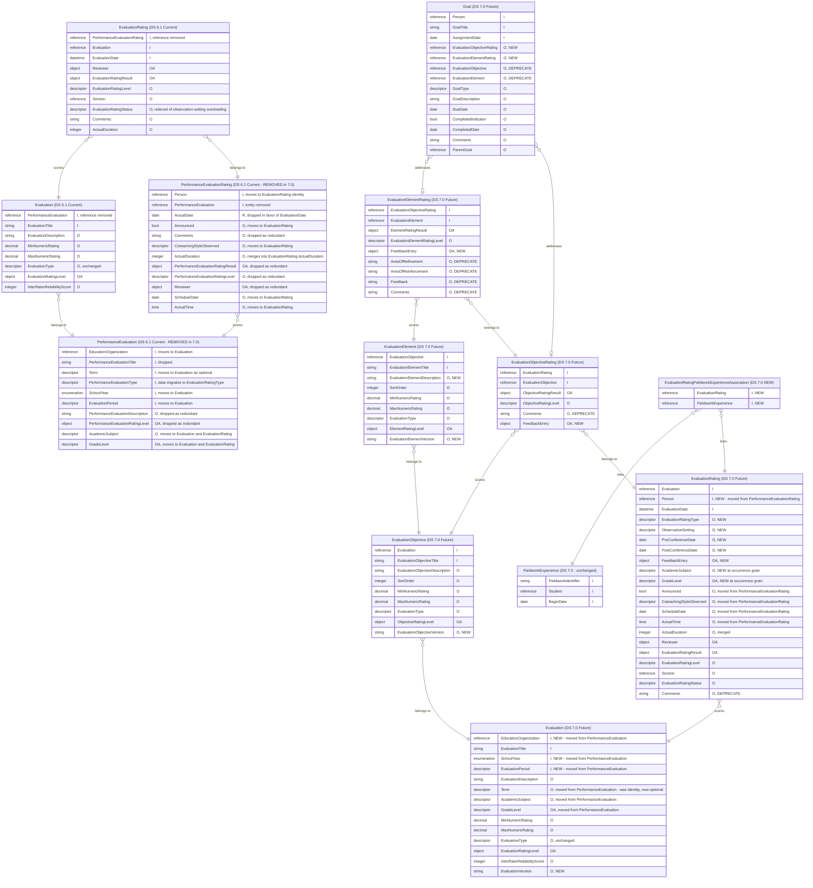

# Ed-Fi RFC 29c: Performance Evaluation Observation, Feedback, and Metadata Grain (Performance Evaluation Domain)

Product: Ed-Fi Data Standard \
Affects: Ed-Fi Data Standard v7.0 \
Obsoletes: -- \
Obsoleted By: -- \
Status: Draft for community feedback \
Author: Steven Arnold (Ed-Fi Alliance)

September 11, 2026

## Synopsis

This Request for Comments (RFC) includes materials that describe proposed revisions to the Ed-Fi Data Standard. This draft material is intended to support review and comment; users of this material are advised that this work is still under development.

RFC 29(c) restructures the Performance Evaluation domain for Ed-Fi Data Standard v7.0. It removes `PerformanceEvaluation` and `PerformanceEvaluationRating`, folding their definition-level metadata into `Evaluation` and their occurrence-level metadata into `EvaluationRating`. It then places evaluation metadata at the grain it actually varies with, and adds observation context, typed feedback, action-step linkage to the scored occurrence, and metadata versioning. This design was developed in collaboration with EdGraph.

This is a **breaking change** for the Performance Evaluation domain. It is being published for community feedback before it is finalized.

---

## Glossary

- **Descriptor** — A reference to a value drawn from an extensible, namespaced code list. Unlike a fixed `Enumeration`, an implementation can add new Descriptor values without a change to the Data Standard itself.
- **Grain** — The level of detail at which a piece of data is captured. In this RFC, *definition grain* describes the evaluation instrument as a whole (`Evaluation`), and *occurrence grain* describes one scored instance of it (`EvaluationRating`). The same kind of information — subject, grade level — can exist at both grains without being redundant, because each grain answers a different question: what the instrument is scoped to, versus what a particular observation actually covered.
- **Object** — A reusable, named group of fields embedded directly within an entity's own data. In the API, an Object appears as a nested JSON object; an **Object array** is a repeatable group of them. Unlike a `Reference`, an Object does not point to another resource — its fields belong to the entity itself.
- **Reference** — An object containing the natural key (identity) values of another resource, used to link one entity to another without embedding that resource's own data. In the API, a Reference appears as a nested object holding only the identifying fields of the resource it points to.

---

## Overview

The Ed-Fi Data Standard currently models educator evaluation as a four-level hierarchy of definitions — `PerformanceEvaluation`, `Evaluation`, `EvaluationObjective`, `EvaluationElement` — each mirrored by a rating entity that records a scored occurrence. `PerformanceEvaluation` sits at the top as the evaluation episode, and `Evaluation` hangs beneath it as the instrument applied within that episode.

That top level carries most of the domain's identifying metadata. `PerformanceEvaluation`'s identity is `EducationOrganization` + `PerformanceEvaluationTitle` + `Term` + `PerformanceEvaluationType` + `SchoolYear` + `EvaluationPeriod` — six components, four of which describe _when_ and _what kind_ rather than _which instrument_. Because every `Evaluation` is keyed by its parent `PerformanceEvaluation`, and every rating chain is keyed by the definition it scores, any variation in term, evaluation type, or period requires a new `PerformanceEvaluation` and therefore a new copy of the entire definition tree beneath it.

This produces three structural problems. First, **repeated observation is expensive to represent**: observing the same educator against the same instrument three times in a term either collapses into one rating or forces duplicate definition metadata, because the metadata that distinguishes the occurrences is fixed in the definition's identity. Second, **metadata sits at the wrong grain**: academic subject, grade level, and evaluation type are properties of a particular observation, not of the instrument, yet they live on the shared definition and cannot vary between occurrences of it. Third, **the occurrence record is thin**: there is no way to record whether an observation was in person or virtual, when the pre- and post-conference happened, what kind of feedback a comment represents, or which scored occurrence produced an assigned action step.

This RFC anchors the model to the **evaluation instrument and its scored occurrences** rather than to an episode wrapper. `PerformanceEvaluation` and `PerformanceEvaluationRating` are removed. `Evaluation` absorbs the definition-grain identity anchors (`EducationOrganization`, `SchoolYear`, `EvaluationPeriod`), keeps `EvaluationTitle`, and takes `Term` as an optional property rather than an identity component. `EvaluationRating` absorbs the occurrence-grain fields, becomes keyed on the person being evaluated, and gains the observation context, typed feedback, and occurrence-grain metadata the domain has been missing. Definition metadata that genuinely applies to both grains — academic subject and grade level — is available at both.

The result is that a recurring observation cycle is represented by one `Evaluation` and many `EvaluationRating` records, with each occurrence carrying its own context, instead of by many near-identical definition trees.

---

## Use Cases

### Observation Context and Conferencing

A classroom observation carries context that determines how its results should be interpreted: whether it was conducted in person or virtually, whether it was announced, and when the pre- and post-observation conferences occurred. Today the model has no home for any of this. Implementers overload `EvaluationRatingStatus`, a field whose purpose is lifecycle state, to carry observation modality, and concatenate conference dates into the free-text `Comments` field, which makes both unusable for analysis and destroys the distinction between the status of a rating and the setting in which it was gathered. Modeling observation setting as its own descriptor, and the conference dates as dates, lets an education organization distinguish a virtual walkthrough from an in-person formal observation, verify that required conferencing occurred within policy windows, and analyze results without parsing prose. It also relieves `EvaluationRatingStatus` of a meaning it was never designed to hold. Separately, an observation conducted as part of a candidate's clinical or fieldwork placement needs to be connectable to that placement, so that preparation programs can relate observed practice to the fieldwork in which it occurred.

### Structured Feedback and Action Steps

Post-observation feedback is not undifferentiated commentary — it is typed. An observer records praise and areas for growth, and coaching frameworks distinguish reinforcement from refinement. The current model expresses this in two incompatible ways at once: a single free-text `Feedback` field that exists only on `EvaluationElementRating`, and two purpose-built fields, `AreaOfRefinement` and `AreaOfReinforcement`, that hard-code exactly two feedback types at exactly one level of the hierarchy. An observer who wants to record praise at the objective level, or a third feedback type, has nowhere to put it. Representing feedback as a repeating structure carrying its own type descriptor, available on all three rating entities, lets feedback be recorded at whatever level it was actually given and typed according to the framework in use, without adding a new field for every new category. The same problem affects assigned action steps: a `Goal` can reference the objective or element it relates to, but not the scored occurrence that prompted it, so an action step cannot be traced back to the observation that generated it or evaluated against the rating it was meant to improve.

### Evaluation Metadata Reuse and Grain

An evaluation instrument is designed to be reused — across occurrences, across educators, and across a school year. The current identity structure prevents that reuse. Because `Term`, evaluation type, subject, and grade level are fixed in or above the definition's identity, an instrument applied in a different term, to a different subject, or in a second observation cycle is a different definition, and its objectives and elements must be duplicated with it. Implementers consequently maintain many copies of what is conceptually one rubric, and cross-occurrence analysis requires reconciling definitions that differ only in metadata. Moving the identity anchors to the instrument itself, making `Term` optional, and placing subject, grade level, and occurrence type on the rating means one instrument definition can serve an entire year of observations while each occurrence still records its own context. Reuse over time also creates a need to know which revision of an instrument produced a given rating, since rubrics are revised between cycles: without a version marker on the definition entities, a rating cannot be interpreted against the rubric that was actually in effect when it was scored.

---

## Model

### Entity Relationship Overview

> **Notation:** `I` = identity / key · `R` = required · `O` = optional · `A` = array (`RA`/`OA`) · flags: `NEW`, `DEPRECATE`, and inline notes for relocations and merges. Entities suffixed `-6` show DS 6.1 as it is today; `-7` shows the proposal. All DS 6.1 field names, types, cardinalities and identity components in this document were verified against `@edfi/ed-fi-model-6.1`, MetaEd `projectVersion` 6.1.0.

`Evaluation` relates to `EvaluationRating` as **1 → 0..\***: one instrument definition may be scored many times, for many people, on many dates. That relationship is the point of this RFC — under DS 6.1 the same reuse requires a duplicated definition tree per variation in term, type, or period.

### Evaluation

`Evaluation` becomes the top of the domain. It absorbs the definition-grain identity anchors that `PerformanceEvaluation` carried — `EducationOrganization`, `SchoolYear`, and `EvaluationPeriod` — and keeps `EvaluationTitle`. `PerformanceEvaluationTitle` is dropped: with the episode wrapper gone there is no separate episode-name concept, and `EvaluationTitle` is the only title going forward.

`Term` moves down from `PerformanceEvaluation` but becomes an **optional property rather than an identity component**. This is the single change that makes instrument reuse possible: with `Term` in the identity, the same rubric applied in the fall and the spring is two definitions with two copies of every objective and element beneath them.

`EvaluationPeriod` is carried into the identity at this time, preserving the existing distinction it draws. Its value as an identifying component is an open question, however: in practice it is often set to a year-round value in much the same way `Term` is, in which case it discriminates nothing while adding a component to every key and every reference. It is retained here pending community input rather than removed unilaterally — see Questions for the Community.

`AcademicSubject` and `GradeLevel` move here from `PerformanceEvaluation` so that an instrument scoped to a subject or grade band can still say so at definition grain. They are _also_ added to `EvaluationRating` (see below), because the same instrument may be applied to different subjects or grades across occurrences. Both remain optional at both grains.

`EvaluationVersion` is new: a marker for which revision of the instrument was in effect, so a rating can be interpreted against the rubric that actually produced it. It is deliberately a plain string rather than a date or a number, since implementers version rubrics inconsistently, and it is not part of the identity — a new version of an instrument is the same instrument, not a new one.

**Identity**

| Field | Type | Description |
|---|---|---|
| `EducationOrganization` | Reference | The education organization that defines the evaluation. Moved from `PerformanceEvaluation`'s identity. |
| `EvaluationTitle` | String (50) | The name of the evaluation instrument. Existing identity component, unchanged. |
| `SchoolYear` | Enumeration | The school year the evaluation applies to. Moved from `PerformanceEvaluation`'s identity. |
| `EvaluationPeriod` | Descriptor | The period within the year the evaluation applies to. Moved from `PerformanceEvaluation`'s identity. Whether it should remain identifying is an open question (see Questions for the Community). |

**Properties**

| Field | Type | Required | Description |
|---|---|---|---|
| `EvaluationDescription` | String (255) | Optional | Existing field, unchanged. |
| `Term` | Descriptor | Optional | Moved from `PerformanceEvaluation`, where it was an identity component. Now optional and non-identifying. |
| `AcademicSubject` | Descriptor | Optional | Moved from `PerformanceEvaluation`. The subject the instrument is scoped to, where it is scoped to one. |
| `GradeLevel` | Descriptor array | Optional | Moved from `PerformanceEvaluation`. The grade level(s) the instrument is scoped to. |
| `MinNumericRating` | Decimal | Optional | Existing field, unchanged. |
| `MaxNumericRating` | Decimal | Optional | Existing field, unchanged. |
| `EvaluationType` | Descriptor | Optional | Existing field, unchanged. Describes the kind of instrument, at definition grain. Distinct from the new `EvaluationRatingType` — see New Descriptors. |
| `EvaluationRatingLevel` | Object array | Optional | Existing field, unchanged. |
| `InterRaterReliabilityScore` | Integer | Optional | Existing field, unchanged. |
| `EvaluationVersion` | String | Optional | New. The revision of the instrument in effect. Non-identifying. |

### EvaluationRating

`EvaluationRating` becomes the scored occurrence and the centre of the domain's new capability. It takes `Person` into its identity from `PerformanceEvaluationRating`, replacing the removed `PerformanceEvaluationRating` reference, and keeps `Evaluation` and `EvaluationDate`. The resulting key — instrument, person, moment — identifies an occurrence directly rather than through an episode wrapper.

Occurrence-grain fields that had no counterpart on `EvaluationRating` move down unchanged: `Announced`, `CoteachingStyleObserved`, `ScheduleDate`, and `ActualTime`. `ActualDuration` exists on **both** entities today, with equivalent documented meaning, so the two **merge into the single existing `EvaluationRating.ActualDuration`**; this is a merge, not a rename, and no field is lost. `PerformanceEvaluationRating.ActualDate` is dropped in favour of the existing `EvaluationDate`, which is already an identity component and already records when the occurrence happened. Fields with a direct duplicate already present — `Comments`, `Reviewer`, `PerformanceEvaluationRatingLevel`, and `PerformanceEvaluationRatingResult` — are dropped as redundant.

Four additions give the occurrence the context it has been missing. `ObservationSetting` records whether the observation was in person, virtual, or hybrid, which relieves `EvaluationRatingStatus` of an overloading it was never designed for — that field returns to carrying lifecycle state only. `PreConferenceDate` and `PostConferenceDate` replace the practice of concatenating conference dates into `Comments`. `FeedbackEntry` carries typed feedback as a repeating structure. `EvaluationRatingType` records the kind of occurrence — see New Descriptors.

`AcademicSubject` and `GradeLevel` appear here as well as on `Evaluation`, at occurrence grain, so that an instrument reused across subjects or grade bands records the actual subject and grade of each observation.

**Identity**

| Field | Type | Description |
|---|---|---|
| `Evaluation` | Reference | The evaluation instrument being scored. Existing identity component, unchanged. |
| `Person` | Reference | The person being evaluated. Moved from `PerformanceEvaluationRating`'s identity, replacing the removed `PerformanceEvaluationRating` reference. |
| `EvaluationDate` | Datetime | When the evaluation occurred. Existing identity component, unchanged. |

**Properties**

| Field | Type | Required | Description |
|---|---|---|---|
| `EvaluationRatingType` | Descriptor | Optional | New. The kind of evaluation occurrence — for example formal, informal, or calibration. Occurrence-grain analogue of `Evaluation.EvaluationType`. |
| `ObservationSetting` | Descriptor | Optional | New. The setting in which the observation was conducted, such as in person or virtual. Replaces the practice of overloading `EvaluationRatingStatus`. |
| `PreConferenceDate` | Date | Optional | New. The date of the pre-observation conference. |
| `PostConferenceDate` | Date | Optional | New. The date of the post-observation conference. |
| `FeedbackEntry` | Object array | Optional | New. Typed feedback provided for this occurrence. See New Object Type. |
| `AcademicSubject` | Descriptor | Optional | New at this grain. The subject observed in this occurrence. |
| `GradeLevel` | Descriptor array | Optional | New at this grain. The grade level(s) observed in this occurrence. |
| `Announced` | Boolean | Optional | Moved from `PerformanceEvaluationRating`, unchanged. |
| `CoteachingStyleObserved` | Descriptor | Optional | Moved from `PerformanceEvaluationRating`, unchanged. |
| `ScheduleDate` | Date | Optional | Moved from `PerformanceEvaluationRating`, unchanged. |
| `ActualTime` | Time | Optional | Moved from `PerformanceEvaluationRating`, unchanged. |
| `ActualDuration` | Integer | Optional | Existing field. `PerformanceEvaluationRating.ActualDuration` merges into it; equivalent meaning, no rename. |
| `Reviewer` | Object array | Optional | Existing field, unchanged. The `PerformanceEvaluationRating` copy is dropped as redundant. |
| `EvaluationRatingResult` | Object array | Optional | Existing field, unchanged. |
| `EvaluationRatingLevel` | Descriptor | Optional | Existing field, unchanged. |
| `Section` | Reference | Optional | Existing field, unchanged. |
| `EvaluationRatingStatus` | Descriptor | Optional | Existing field, unchanged in structure. Its intended meaning — lifecycle state, such as in progress or completed — is restored now that `ObservationSetting` exists. |
| `Comments` | String (1024) | Optional | Existing field, **deprecated**. Superseded by `FeedbackEntry`, which carries the same free text with a type. |

### EvaluationObjective

Gains `EvaluationObjectiveVersion`, matching `Evaluation`'s versioning so that a revised objective can be identified without changing its identity. All other fields are unchanged.

**Properties (changes only)**

| Field | Type | Required | Description |
|---|---|---|---|
| `EvaluationObjectiveVersion` | String | Optional | New. The revision of the objective in effect. Non-identifying. |

### EvaluationObjectiveRating

Gains `FeedbackEntry`, so that typed feedback can be recorded at the objective level rather than only at the element level.

**Properties (changes only)**

| Field | Type | Required | Description |
|---|---|---|---|
| `FeedbackEntry` | Object array | Optional | New. Typed feedback provided against this objective rating. |
| `Comments` | String (1024) | Optional | Existing field, **deprecated**. Superseded by `FeedbackEntry`. |

### EvaluationElement

Gains `EvaluationElementDescription` and `EvaluationElementVersion`. The description closes a genuine asymmetry: `EvaluationObjective` has `EvaluationObjectiveDescription` (String, 255) but `EvaluationElement` has only `EvaluationElementTitle`, so the text of a rubric criterion has nowhere to live except the title. The new field mirrors the objective's description in type and length.

**Properties (changes only)**

| Field | Type | Required | Description |
|---|---|---|---|
| `EvaluationElementDescription` | String (255) | Optional | New. The description of the element. Mirrors `EvaluationObjective.EvaluationObjectiveDescription`. |
| `EvaluationElementVersion` | String | Optional | New. The revision of the element in effect. Non-identifying. |

### EvaluationElementRating

Gains `FeedbackEntry`. Four existing free-text fields are **proposed for deprecation**, not removal: `AreaOfRefinement` and `AreaOfReinforcement` hard-code two feedback types into the model where `FeedbackEntry`'s `FeedbackType` now expresses any number, and `Feedback` and `Comments` are untyped single values superseded by the same structure. All four are retained in v7.0 with deprecation flags so existing integrations do not break; whether and when to remove them is put to the community below.

**Properties (changes only)**

| Field | Type | Required | Description |
|---|---|---|---|
| `FeedbackEntry` | Object array | Optional | New. Typed feedback provided against this element rating. |
| `AreaOfRefinement` | String (1024) | Optional | Existing field, **deprecated**. Superseded by `FeedbackEntry` with an appropriate `FeedbackType`. |
| `AreaOfReinforcement` | String (1024) | Optional | Existing field, **deprecated**. Superseded by `FeedbackEntry` with an appropriate `FeedbackType`. |
| `Feedback` | String (2048) | Optional | Existing field, **deprecated**. Superseded by `FeedbackEntry`. |
| `Comments` | String (1024) | Optional | Existing field, **deprecated**. Superseded by `FeedbackEntry`. |

### Goal

`Goal` gains optional references to `EvaluationObjectiveRating` and `EvaluationElementRating`, so an assigned action step can point at the scored occurrence that prompted it rather than only at the catalog entry it concerns. The existing `EvaluationObjective` and `EvaluationElement` references are **retained and flagged deprecated**, not removed, so this ships as a deprecation window rather than a break for existing integrations.

**Properties (changes only)**

| Field | Type | Required | Description |
|---|---|---|---|
| `EvaluationObjectiveRating` | Reference | Optional | New. The scored objective occurrence this action step addresses. |
| `EvaluationElementRating` | Reference | Optional | New. The scored element occurrence this action step addresses. |
| `EvaluationObjective` | Reference | Optional | Existing field, **deprecated** in favour of `EvaluationObjectiveRating`. |
| `EvaluationElement` | Reference | Optional | Existing field, **deprecated** in favour of `EvaluationElementRating`. |

### EvaluationRatingFieldworkExperienceAssociation

A new association entity linking a scored evaluation occurrence to the fieldwork placement it occurred within, so that educator preparation programs can relate observed practice to clinical experience.

This is modeled as an **association entity rather than an embedded reference on `EvaluationRating`** deliberately. `FieldworkExperience` has no cross-domain consumers today outside its own Educator Preparation domain, and its one existing external link, `FieldworkExperienceSectionAssociation`, is itself an association rather than an embedded foreign key. An embedded reference would make Performance Evaluation the first domain to reach directly into `FieldworkExperience`. By contrast `Section`, which _is_ referenced directly from `EvaluationRating` today, is consumed across 15 domains in DS 6.1 and functions as a universal anchor. Following the existing pattern keeps the coupling loose and reversible.

**Identity**

| Field | Type | Description |
|---|---|---|
| `EvaluationRating` | Reference | The scored evaluation occurrence. |
| `FieldworkExperience` | Reference | The fieldwork placement the occurrence took place within. |

### New Object Type: FeedbackEntry

A repeating structure carrying one piece of typed feedback. Added to `EvaluationRating`, `EvaluationObjectiveRating`, and `EvaluationElementRating`.

| Field | Type | Required | Description |
|---|---|---|---|
| `FeedbackType` | Descriptor | Required | The kind of feedback — for example praise or area of growth. |
| `FeedbackComment` | String | Optional | The feedback text. |

#### Why the name is `FeedbackEntry` and not `Feedback`

The obvious name is `Feedback`. It is not available, and the reason matters
beyond this RFC.

`Feedback` already exists in DS 6.0 and DS 6.1 as a core `string` on
`EvaluationElementRating` (String, 2048). Within a single entity an object
array and a string property cannot share a name, so an object called
`Feedback` on `EvaluationElementRating` collides with a field that ships today.

The deciding constraint, however, is not the collision inside this RFC — it is
that **this object must be deployable as an extension to DS 6.x now**, ahead of
the v7.0 release that brings it into core. Implementers need typed feedback
before v7.0 ships, and an extension is the only way to get it. That extension
adds the object to entities in a live DS 6.x model where the core `Feedback`
string is present and cannot be removed, so the extension is obliged to pick a
non-colliding name.

Choosing `FeedbackEntry` now means the name used in a DS 6.x extension today is
the same name that arrives in core at v7.0. An implementer who adopts the
extension early carries their data, integrations, and API clients forward
without a rename when core catches up, and the eventual migration is a change of
namespace rather than a change of shape.

This also explains why the name is not reconsidered at v7.0 even though
`Feedback` is deprecated there. Freeing the name would require removing the core
string outright, which would break every DS 6.x implementation still using it
and would strand the early adopters whose extension is named `FeedbackEntry`.
The name is chosen for continuity across the 6.x-to-7.0 boundary, not for
elegance in isolation.

### New Descriptors

| Descriptor | Notes |
|---|---|
| `ObservationSetting` | New. The setting of an observation, such as in person, virtual, or hybrid. Exists so that `EvaluationRatingStatus` is no longer overloaded to carry modality. |
| `FeedbackType` | New. The kind of feedback carried by a `FeedbackEntry`, such as praise or area of growth. Supersedes the hard-coded `AreaOfRefinement` / `AreaOfReinforcement` pair. |
| `EvaluationRatingType` | New. The kind of evaluation occurrence — for example formal, informal, or calibration. See below. |

### Design Principle: Metadata Lives at the Grain It Varies With

Every placement decision in this RFC follows one rule: a field belongs on the entity whose grain it actually varies with.

- Varies by **instrument** → `Evaluation`. Title, description, rating bounds, instrument type, version, and the subject or grade the instrument is scoped to.
- Varies by **occurrence** → `EvaluationRating`. Observation setting, conference dates, occurrence type, duration, whether it was announced, and the subject and grade actually observed.

This is why `Term` leaves the identity, why `AcademicSubject` and `GradeLevel` appear at _both_ grains rather than being moved from one to the other, and why `EvaluationRatingType` is a separate field from `EvaluationType` rather than a relocation of it. The DS 6.1 problem this RFC addresses is not that metadata is missing — most of it exists — but that it is pinned at a grain coarser than the thing it describes.

### Why EvaluationRatingType is a New Descriptor

`EvaluationRatingType` is a new descriptor rather than a reuse of the existing `EvaluationType` descriptor at the rating grain. The distinction is deliberate and worth stating plainly, because the reuse option is defensible.

`EvaluationType` describes the kind of _instrument_. `EvaluationRatingType` describes the kind of _occurrence_ — a formal observation, an informal drop-in, or a calibration exercise between observers scoring the same lesson. These are different value sets serving different questions, and a single shared descriptor would mix instrument-level and occurrence-level values in one list, leaving consumers unable to tell which applied at which grain.

Note that the argument used for `InstructionalSubject` in RFC 29a — that the existing descriptor's value set is contaminated by unrelated domains — does **not** apply here. `EvaluationType` is used only on `Evaluation`, `EvaluationObjective`, and `EvaluationElement`, all within this domain. The separation here is chosen on grain alone.

Three descriptors now sit adjacent on `EvaluationRating` and are easily confused. They answer different questions:

| Descriptor | Question | Example values |
|---|---|---|
| `EvaluationRatingType` | What kind of occurrence was this? | formal, informal, calibration |
| `EvaluationRatingStatus` | Where is this rating in its lifecycle? | in progress, completed |
| `ObservationSetting` | How was it conducted? | in person, virtual |

---

## Breaking Changes & Migration

The proposed identity changes:

| Entity | DS 6.1 key | Proposed DS 7.0 key |
|---|---|---|
| `PerformanceEvaluation` | `EducationOrganization` + `PerformanceEvaluationTitle` + `Term` + `PerformanceEvaluationType` + `SchoolYear` + `EvaluationPeriod` | — entity removed |
| `PerformanceEvaluationRating` | `Person` + `PerformanceEvaluation` | — entity removed |
| `Evaluation` | `PerformanceEvaluation` + `EvaluationTitle` | `EducationOrganization` + `EvaluationTitle` + `SchoolYear` + `EvaluationPeriod` |
| `EvaluationRating` | `PerformanceEvaluationRating` + `Evaluation` + `EvaluationDate` | `Evaluation` + `Person` + `EvaluationDate` |
| `EvaluationObjective` | `Evaluation` + `EvaluationObjectiveTitle` | Unchanged; cascades through `Evaluation`'s new key |
| `EvaluationObjectiveRating` | `EvaluationRating` + `EvaluationObjective` | Unchanged; cascades |
| `EvaluationElement` | `EvaluationObjective` + `EvaluationElementTitle` | Unchanged; cascades |
| `EvaluationElementRating` | `EvaluationObjectiveRating` + `EvaluationElement` | Unchanged; cascades |
| `Goal` | `Person` + `GoalTitle` + `AssignmentDate` | Unchanged |
| `EvaluationRatingFieldworkExperienceAssociation` | — | `EvaluationRating` + `FieldworkExperience` |

Change by change:

- `PerformanceEvaluation` and `PerformanceEvaluationRating` are **removed**. Every implementation storing data in them must migrate.
- `EducationOrganization`, `SchoolYear`, and `EvaluationPeriod` **relocate** from `PerformanceEvaluation`'s identity to `Evaluation`'s identity.
- `Term` **relocates** from `PerformanceEvaluation`'s identity to `Evaluation` as an **optional, non-identifying property**. Implementations relying on `Term` being present must now enforce that themselves.
- `PerformanceEvaluationTitle` is **dropped**. `EvaluationTitle` is the only title going forward.
- `PerformanceEvaluationType` is removed as a field, and its **values migrate to the new occurrence-grain `EvaluationRatingType`** on each `EvaluationRating`. This is a relocation of the data to a finer grain, not a discard: a single DS 6.1 `PerformanceEvaluationType` value will apply to every occurrence that descended from that `PerformanceEvaluation`.
- `Person` **relocates** from `PerformanceEvaluationRating`'s identity into `EvaluationRating`'s identity.
- `Announced`, `CoteachingStyleObserved`, `ScheduleDate`, and `ActualTime` **relocate** unchanged from `PerformanceEvaluationRating` to `EvaluationRating`.
- `ActualDuration` exists on both entities with equivalent meaning and **merges** into the existing `EvaluationRating.ActualDuration`. No rename, no loss.
- `PerformanceEvaluationRating.ActualDate` (Date, required) is **dropped** in favour of the existing `EvaluationRating.EvaluationDate` (Datetime, identity). Implementations relying on date-only semantics should note the type difference.
- `PerformanceEvaluationDescription`, `PerformanceEvaluationRatingLevel`, `PerformanceEvaluationRatingResult`, and the `PerformanceEvaluationRating` copies of `Reviewer` and `Comments` are **dropped as redundant** — each has a direct counterpart already on `Evaluation` or `EvaluationRating`.
- `AcademicSubject` and `GradeLevel` **relocate** from `PerformanceEvaluation` to `Evaluation`, and are **also added** to `EvaluationRating` at occurrence grain.
- `AreaOfRefinement`, `AreaOfReinforcement`, and `Feedback` on `EvaluationElementRating` are **deprecated, not removed**.
- `Comments` on `EvaluationRating`, `EvaluationObjectiveRating`, and `EvaluationElementRating` is **deprecated, not removed**, superseded by `FeedbackEntry`. `Goal.Comments` is unaffected, since `FeedbackEntry` is not added to `Goal`.
- `Goal`'s `EvaluationObjective` and `EvaluationElement` references are **deprecated, not removed**.

---

## Questions for the Community

1. **Should `EvaluationPeriod` remain part of the identity?** The proposal carries `EvaluationPeriod` down from `PerformanceEvaluation` into `Evaluation`'s new identity, but its value as an identifying component has not been observed in practice — implementations commonly set it to a year-round value, much as they do with `Term`. If it does not distinguish one evaluation from another, it is adding a required component to every key and every reference for no discriminating benefit. Dropping it would make the identity `EducationOrganization` + `EvaluationTitle` + `SchoolYear`, with `EvaluationPeriod` retained as an optional property in the same way `Term` is. Is anyone using `EvaluationPeriod` to genuinely distinguish separate evaluations within a school year?
2. **`Term` becoming optional.** Relatedly: with `Term` off the identity and optional, is any state reporting requirement broken by the standard no longer guaranteeing its presence?
3. **Should the identifying titles become identifier strings?** Each level of the hierarchy is keyed by a title — `EvaluationTitle`, `EvaluationObjectiveTitle`, `EvaluationElementTitle` — which makes a human-readable label load-bearing as a key, so correcting a typo is a key change. Ed-Fi model standards name a string that serves as an identity with an **`Identifier`** suffix, the convention applied in RFC 29a when `PositionControlNumber` became `PositionIdentifier`. Applying it here would give `EvaluationIdentifier`, `EvaluationObjectiveIdentifier`, and `EvaluationElementIdentifier`, with the titles retained as optional descriptive labels.

   Two observations for consideration. Within this domain the title lengths are already inconsistent — `EvaluationTitle` and `EvaluationObjectiveTitle` are String (50) while `EvaluationElementTitle` is String (255) — which suggests the fields are serving as both label and key without a settled convention. Across the wider model, however, title-as-identity is common rather than anomalous: 12 identity strings end in `Title`, including `AssessmentTitle`, `CourseTitle`, and `ProgramEvaluationTitle`, against 16 that end in `Identifier`. Changing it in this domain alone would therefore be a deliberate local departure from a broad existing pattern, and changing it model-wide is well beyond this RFC. Is the separation of key from label worth the migration cost here, and should it be taken up for the model as a whole rather than for this domain in isolation?
4. **`EvaluationRatingType` as a new descriptor.** The proposal mints a new descriptor rather than reusing `EvaluationType` at the rating grain, on the argument that instrument type and occurrence type are different value sets. The reuse option is defensible, since `EvaluationType`'s scope is already confined to this domain. Does anyone have a use case that would be better served by one shared type descriptor across both grains?
5. **Subject and grade level at two grains.** `AcademicSubject` and `GradeLevel` are proposed on both `Evaluation` and `EvaluationRating`. Is the definition-grain copy still needed once the occurrence-grain one exists, or does keeping both invite disagreement between them?
6. **Deprecating the free-text feedback fields.** `AreaOfRefinement`, `AreaOfReinforcement`, `Feedback`, and `Comments` on the three rating entities are retained with deprecation flags rather than removed, even though v7.0 is already a breaking release. Should they be removed in 7.0 instead, or is a deprecation window necessary? `Comments` has been present on these entities far longer than the others and is likely the most widely populated, so its removal would be the most disruptive of the four.

   **`Comments` also raises a question the other three do not.** `AreaOfRefinement`, `AreaOfReinforcement`, and `Feedback` are all unambiguously feedback directed at the person being evaluated, so `FeedbackEntry` supersedes them cleanly — each becomes an entry with an appropriate `FeedbackType`. `Comments` is broader. It is documented as "Any comments about the evaluation to be captured", which in practice includes administrative and procedural notes that are not feedback to the evaluatee at all: scheduling context, data-quality caveats, or a reviewer's note to the next reader.

   Folding `Comments` into `FeedbackEntry` therefore depends on how `FeedbackType` is scoped. If its values are limited to coaching categories such as praise, area of growth, refinement, and reinforcement, an administrative note about an observation has no valid type and nowhere to go, and implementers will either mistype it or retain a local extension for it. Two ways forward: include a general or administrative value in `FeedbackType` so `Comments` genuinely has a successor, or accept that `Comments` and typed feedback are different concepts and retain `Comments` on these entities rather than deprecating it. Which does the community prefer, and does anyone rely on `Comments` for content that is clearly not feedback?
7. **`Goal`'s catalog references.** The existing `EvaluationObjective` and `EvaluationElement` references on `Goal` are deprecated in favour of the occurrence references. Is anyone relying on the catalog-level linkage in a way the occurrence-level reference would not serve?

---

## Timeline

- **Target release:** DS 7.0
- **Community:** open for feedback now, ahead of finalization and review by the Data Standard Workgroup.

---

## How to Respond

Please comment with your implementation context — if you encountered issues with how `PerformanceEvaluation` and `Evaluation` is designed, how many definitions you maintain per instrument, and whether you have extended this domain — along with your answers to the questions above. Your feedback will shape the final RFC submitted to the governance process.
